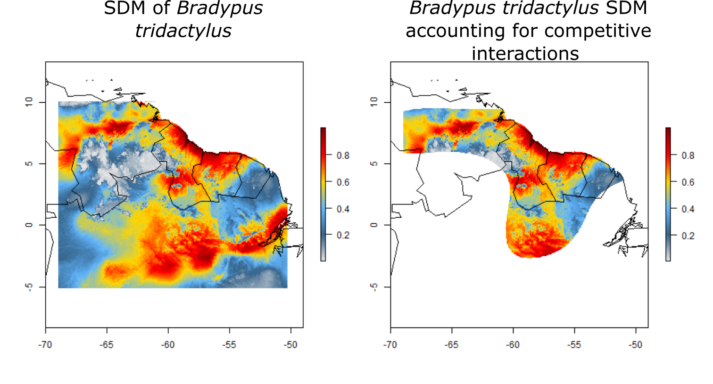

```{r setup, include=FALSE}
knitr::opts_chunk$set(echo = TRUE)
```
</br>
</br>
Click here to learn about our new R package [*changeRangeR*](./changeRangeRwebsite.html)

<font size="4">
*maskRangeR* is an R package that refines species distribution models (SDMs) to improve estimates of species' current ranges in several ways:

  - spatiotemporally matching in-situ observations of species’ occurrence with environmental and/or remotely sensed data e.g., MODIS-derived) to assess tolerances
  
  - directly incorporating expert knowledge of species' ranges
  
  - sequential masking of driving environmental variable tolerances 
  
  - accounting for competitive interactions

Refined range maps can be considered as improved representations of a species' realized distribution, aiding in conservation decision-making.

Additionally, *maskRangeR* will soon be available as a module for [*Wallace*](https://wallaceecomod.github.io/); a user-friendly R application for species distribution modeling that provides guidance towards following best-practices at each step of the process. This application makes state-of-the-art modeling tools accessible and transparent to users without having to rely on computer coding skills. 

</font>

<center>

</br>
SDMs can be refined to account for competitive interactions. 
</center>

## **Vignette**

[Click here for the *maskRangeR* vignette.](maskRangeR_Tutorial.html)

### **Training materials**
<font size="4">Also in development are training materials and best practices for modeling species' niches and distributions in biodiversity change indicator assessments for the expanded Wallace in both English and Spanish. Materials will be web-based and openly available. They will be available as both guidance text within *Wallace* and also published as part of an open source teaching module for the Center for Biodiversity and Conservation at the American Museum of Natural History ([CBC-AMNH](https://www.amnh.org/our-research/center-for-biodiversity-conservation)) Network of Conservation Educators and Practitioners ([NCEP](https://www.amnh.org/our-research/center-for-biodiversity-conservation/capacity-development/ncep)). NCEP is a global initiative that seeks to improve the availability and quality of conservation education and professional training.</font>


## **BioModelos and *Wallace* integration**
<font size="4">The Group on Earth Observations Biodiversity Observation Network ([GEO-BON](https://geobon.org/)) works to improve the communication of biodiversity measurements to decision makers and the broader scientific community. To locally serve regional scientific and political communities, GEO-BON has implemented a [BON-in-a-Box](https://geobon.org/bon-in-a-box/) service that delivers customizable online toolkits for enhancing biodiversity observation systems.

[*BioModelos*](http://biomodelos.humboldt.org.co/) is a BON-in-a-box tool for Colombia’s BON. *BioModelos* bridges  modeling and taxonomy experts by facilitating occurrence record curation, model editing, suitable ecological variable identification, and providing a model vetting process. 

The integration of BioModelos and *Wallace* leverages the expert knowledge available in BioModelos with the easy-to-use interface and expert modeling tools of *Wallace*. Registered users are able to import expert-verified occurrence records and range maps, and have the ability to push SDMs and further-refined range maps back to BioModelos.

This synergistic relationship allows conservation practitioners to access important model statistics (indicators of biodiversity and ecosystem services) such as: extent of occurrence, proportion of range under protected status, and projected change in future scenarios.
</font>


*maskRangeR* package development was funded by the NASA ROSES award No. 80NSSCK0406 to collaboratively improve the utility of the Colombia BON-in-a-Box toolkit as well as build capacity for conservation practitioners and educators. Any opinions, findings, and conclusions or recommendations expressed in this material are those of the author(s) and do not necessarily reflect the views of the National Aeronautics and Space Administration.


<center>

[](https://www.nasa.gov/)[](https://geobon.org/)

[](https://www.pace.edu/)[](https://www.ccny.cuny.edu/)[](http://www2.cuny.edu/)[](https://uconn.edu/)[](http://www.humboldt.org.co/en/)
[](https://www.amnh.org/our-research/center-for-biodiversity-conservation)
</center>
