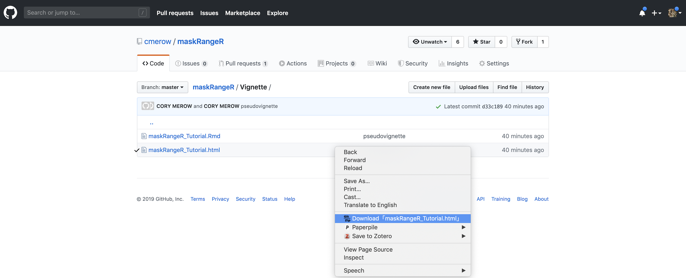

Our demo requires data larger than we can store on CRAN and involves analyses that run for a few minutes, which also isn't allowed, so we maintain our most comprehensive tutorial on github. Please see our complete tutorial on our github page at:

[https://github.com/cmerow/maskRangeR/tree/master/Vignette](https://github.com/cmerow/maskRangeR/tree/master/Vignette)

To download it (you can't just right-click on github), its easiest to install the chrome extentsion Gitzip:
[https://chrome.google.com/webstore/detail/gitzip-for-github/ffabmkklhbepgcgfonabamgnfafbdlkn](https://chrome.google.com/webstore/detail/gitzip-for-github/ffabmkklhbepgcgfonabamgnfafbdlkn)
You can then right-click on the file and an option to download is available, as shown below:
 

